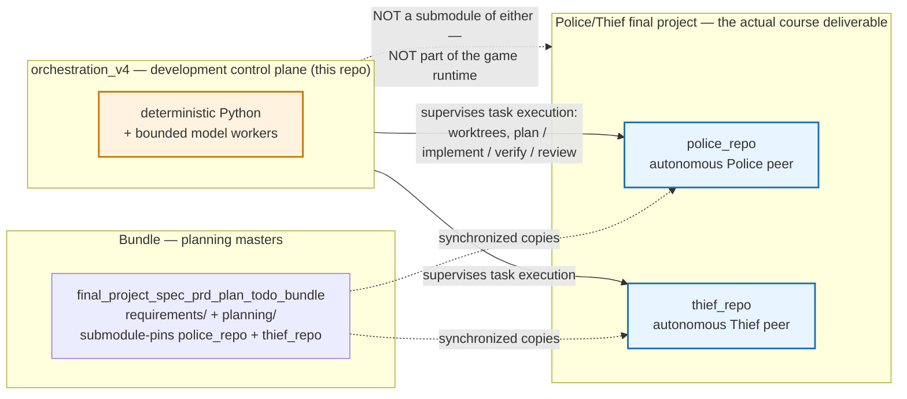
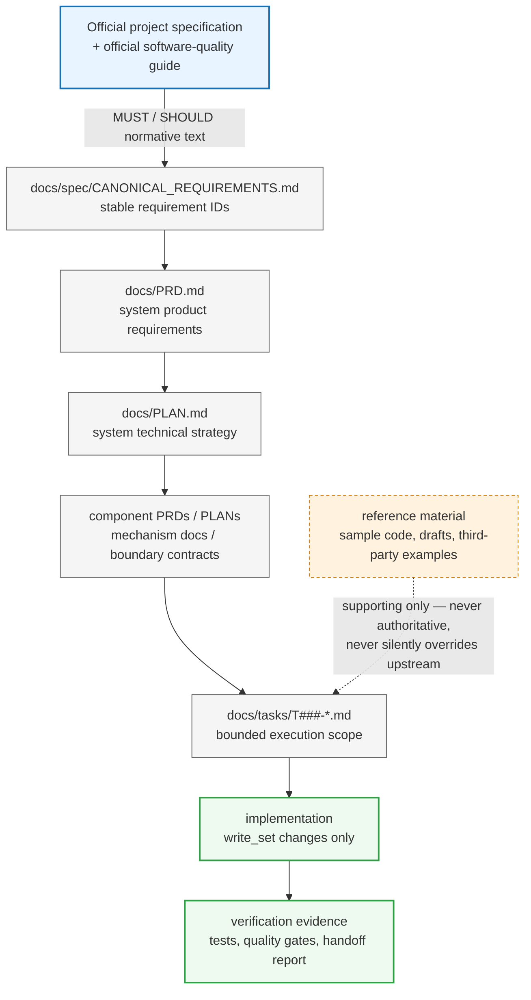
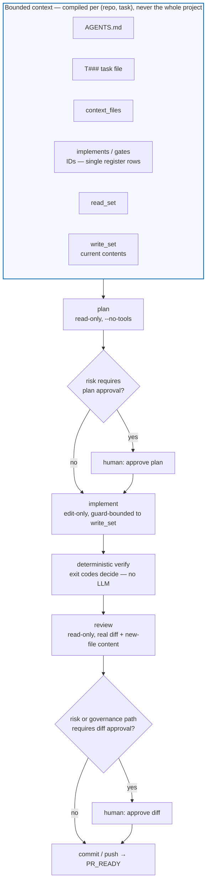
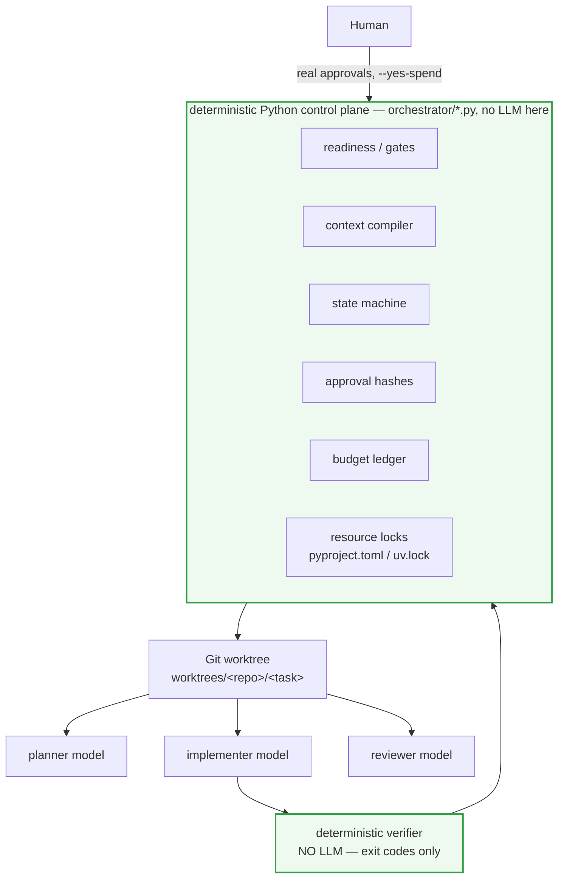
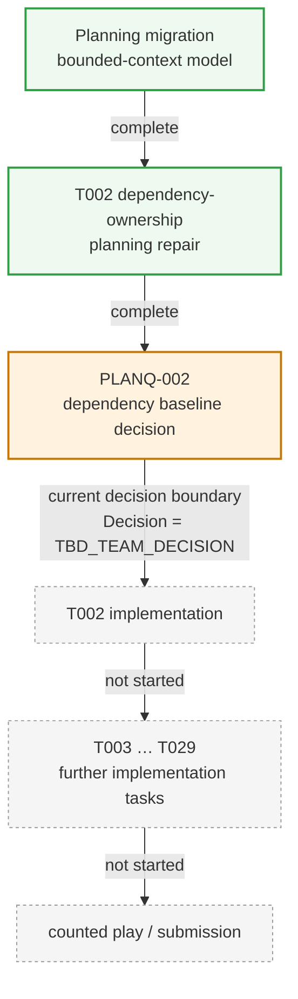

# orchestration_v4 — bounded multi-agent orchestrator

A deterministic development control plane for the Police/Thief final project.
It supervises task execution in `police_repo` and `thief_repo`. It is **not**
part of either project and implements none of their tasks.

This is v4, a surgical redesign of `orchestrate_v3.py`. v3 is preserved
byte-for-byte as the reference prototype and is not edited by this workspace.

---

## What this repository is — and is not



The Police/Thief peers are the product: two autonomous, symmetric processes
implementing a hidden-state P2P game, each with its own repository. The Bundle
holds the shared planning masters (canonical requirements, system PRD/PLAN,
component contracts) that `police_repo` and `thief_repo` keep synchronized
local copies of. `orchestration_v4` is a third thing, sitting outside both: it
is the mechanism a human uses to supervise bounded, auditable implementation
work against those two repositories. It never ships as part of the game, is
never imported by either peer, and is not a submodule of the Bundle.

## Why it exists

Running an LLM agent against a repository at full autonomy is fast to start
and hard to trust: nothing stops it from reading the whole project when a task
needs one file, silently widening its own write scope, or self-certifying that
its own work is correct. This project exists to remove that trust requirement.
An LLM here is a text generator confined to a boundary — never the scheduler,
never the source of project readiness semantics, never its own verifier.
Which task may run, what it may read, what it may write, whether its tests
passed, and whether a human approved it are all decided by deterministic
Python reading the project's own planning artifacts, not by asking a model to
behave.

## Planning and authority hierarchy



Every layer below the official specification is *derived* — it exists to make
the official text actionable, and it must not restate or widen it. A task's
`context_files` and `implements`/`gates` frontmatter point back up this chain
to exactly the rows it needs, never to the whole chain. Reference material
(sample payloads, drafts, third-party snippets) never closes a requirement or
an OPEN item on its own; only a verified official source or an approved team
decision does. `AGENTS.md` in each role repository states this hierarchy
explicitly and instructs every worker — human or model — to stop and escalate
a contradiction rather than pick a side.

## Bounded task lifecycle



A worker starts from roughly a handful of files, per the role repositories'
`AGENTS.md` — not all 115 canonical requirements, all 29 tasks, the whole
Bundle, or every component PRD. Two boundaries are deliberate:

- **IDs come from frontmatter, never from prose.** A task's body saying "the
  GUI toolkit, which `PLANQ-007` owns" is a scope *exclusion*, not a request.
  The compiler records `PLANQ-007` as EXCLUDED with that reason instead of
  loading GUI material.
- **A missing declared file is an error, not a search.** If the compiler
  cannot justify a file, it does not include it; a declared-but-absent path
  refuses with `CONTEXT_FILE_MISSING` rather than triggering a broader read.

The `write_set` is the only mutation scope for the entire lifecycle — enforced
before every write (see [Write-set enforcement](#write-set-enforcement)), not
merely audited afterward. Inspect exactly what a model would receive, with no
model call and no cost:

```sh
uv run orchestrate_v4.py context --repo police --task T002
uv run orchestrate_v4.py context --repo police --task T002 --json
```

Every entry is classified `FULL_FILE`, `TARGETED`, `WRITE_OWNED`, `MISSING` or
`EXCLUDED`, with an access level and the reason it is there.

## Development control-plane architecture



Concretely, a model never: picks the next task, decides a gate is resolved,
widens its own write set, declares its own verification passed, or creates an
approval receipt. Model **roles** are configuration, not code (see
[Model routing](#model-routing) for the full table): a mid-cost model is the
default bounded writer, an independent model of a different family reviews it,
a cheap model absorbs reconnaissance, and stronger reasoning is reserved for
genuine conflicts; the verifier has no model in its loop at all — it runs the
task's declared commands and reads their exit codes.

## Current project phase



No application code has been written yet. `orchestration_v4` exists to
supervise the implementation phase once it starts, not to mark that it has.
Concretely, in both `police_repo` and `thief_repo` right now: the
bounded-context planning migration is complete; the T002 dependency-ownership
repair is complete; `PLANQ-002` (the dependency baseline decision T002 needs
to close its `dependency_lock` acceptance criterion) is still
`TBD_TEAM_DECISION`. T002 is formally **READY** — claimable and implementable —
because `PLANQ-002` is declared `blocks: criterion`, not `blocks: start`; it is
simply not yet implemented. Every other task depends on T001/T002 and remains
blocked. `orchestrate_v4 status` reflects this live from the repositories'
own registers, not from this document.

## Key safety properties

- **Bounded context, not the whole project.** Compiled per task from
  frontmatter alone; a missing declared file refuses rather than triggers a
  search. See [Bounded task lifecycle](#bounded-task-lifecycle).
- **Mandatory, repository-qualified worktrees.** Every model stage requires a
  recorded, fresh task worktree; there is no fallback to the real Police/Thief
  checkout. See [Worktrees](#worktrees).
- **Pre-write path enforcement, not just a post-run audit.** A blocking Pi
  hook confines the implementer's writes to the worktree and the declared
  `write_set` before they happen. See
  [Write-set enforcement](#write-set-enforcement).
- **Artifact-bound approvals.** A human approval is void if the artifact, base
  commit, stage or repository identity changes by as much as a byte. See
  [Approval hashes](#approval-hashes).
- **Deterministic verification.** Exit codes decide pass/fail; no model
  renders that verdict. See [Write-set enforcement](#write-set-enforcement).
- **Governed spend.** No paid model call happens without an explicit
  `--yes-spend`, a per-call ceiling and a daily budget with a reserve. See
  [Local vs. paid routing, and budget control](#local-vs-paid-routing-and-budget-control).
- **`PR_READY` is not `DONE`.** It means the local implementation/review
  policy is satisfied and a candidate is eligible to ship — never that every
  acceptance criterion or integration gate has passed. See
  [Project gates vs. human review gates](#project-gates-vs-human-review-gates).

Each is covered in full detail in the sections below.

## Project gates vs. human review gates

These are two different things and are represented independently.

**Project gates** come from project planning and live in task frontmatter:
`PLANQ-002`, `G-OFFICIAL`, `blocks: start | criterion | integration`.

The readiness rule is exactly:

```
all depends_on tasks are done
AND no unresolved gate has  blocks: start
```

`blocks: criterion` and `blocks: integration` do **not** make a task unready.
T002 carries `PLANQ-002` at `blocks: criterion`, so it is claimable and
implementable now; only the `dependency_lock` acceptance criterion waits.

The rest of the gate lifecycle is exposed as status, not enforced as a blocker,
because **project readiness**, **local PR readiness**, **criterion closure** and
**integration completion** are four different things:

| level | claim | plan / implement / verify / review | local candidate PR (`pr` → `PR_READY`) | what it actually gates |
|---|---|---|---|---|
| `blocks: start` | refuses (`START_GATE_UNRESOLVED`) | — | — | the task cannot be claimed at all |
| `blocks: criterion` | proceeds | proceeds | **proceeds**, reported as a pending criterion | only a claim that the *named acceptance criterion* is satisfied, and therefore the task being marked done |
| `blocks: integration` | proceeds | proceeds | **proceeds**, reported as a pending integration gate | only a claim that the *named integration gate* has passed |

`PR_READY` means the local implementation/review policy is satisfied and the
candidate is eligible to be committed, pushed and opened as a PR. It does
**not** mean the task is done, that every acceptance criterion is satisfied, or
that any integration gate has passed — an unresolved criterion or integration
gate never blocks reaching it. `pr` prints every pending gate by ID and scope
and records it under `provenance.pending_project_gates`, so PR_READY carries its
own outstanding gates as structured status rather than silently dropping them.
v4 deliberately has no automatic task-close or merge/integration stage yet;
**a future close/merge command MUST enforce these pending gates** before
treating a criterion as satisfied or a task as done.

Gate resolution is derived from the repository's own registers — the
Implementation Decision Register's `Decision` cell, the active OPEN item table,
the input register's `Status` column. Where no mechanical marker exists (the
`G-*` gate *classes* are human judgements about many underlying items), the
harness reports `UNKNOWN_GATE_STATE` and conservatively refuses a start-blocked
task rather than guessing.

**Orchestration review gates** are our development-control policy, keyed by the
task's `risk` field in `config/orchestrator.yaml`:

| risk | required human gates |
|---|---|
| high | plan approval + diff approval |
| medium | diff approval |
| low | none, if all deterministic verification passes |

Regardless of risk, any diff touching a governance path (`AGENTS.md`,
`docs/PRD.md`, `docs/PLAN.md`, `docs/TODO.md`, `docs/spec/`, `docs/decisions/`,
`docs/changes/`, `CONTRIBUTING.md`) always requires human diff approval. A
medium-risk task can be project-ready and still need a human before it ships.

## Worktrees

Police T002 and Thief T002 are different tasks. Worktrees are therefore
repository-qualified:

```
worktrees/police/T002/
worktrees/thief/T002/
```

Each records its repo, repo identity, task ID, base ref, resolved base SHA,
branch and creation time. A worktree built on a base that has since moved is
reported stale (`WORKTREE_STALE_BASE`) instead of being silently reused.

**Every model stage requires one.** `plan`, `implement`, `review`, `verify`, diff
approval and `pr` all operate on the recorded task worktree and refuse with
`WORKTREE_MISSING` if it does not exist, or `WORKTREE_STALE_BASE` if its base has
moved. There is no fallback to the role repository checkout — a forgotten
`worktree` step must refuse, never run a model against the real Police or Thief
tree. Worktree creation stays a separate, explicit, auditable command.

Bounded context is read from that worktree too, so the manifest always describes
the tree actually being edited. The manifest still records the *repository*
identity, so a worktree never becomes a separate repo for approval binding. The
standalone `context` command may read the main checkout only when it can prove
that checkout is clean and its tree equals the base commit's tree; otherwise it
refuses with `TREE_NOT_PROVEN` rather than showing mismatched context.

Runtime metadata — prompts, plans, logs, verification reports — lives in
`state/agent/<repo>/<task>/`, **outside** the worktree, so it cannot be
committed as product code.

## Approval hashes

v3's receipt was `{"approved": true}`, which approves nothing in particular. A
v4 receipt names the artifact:

```json
{
  "task_id": "T002", "repo": "police",
  "repo_identity": "police@https://github.com/evya1/police_repo.git",
  "stage": "diff", "base_sha": "3cba1d9…",
  "artifact_sha256": "…", "approved": true,
  "at": "2026-08-16T…+00:00", "note": "…"
}
```

Validation recomputes all of it. An approval is void if the artifact changes by
one byte, if the base commit moves, if the stage differs, or if it belongs to
the other repository — even when the task ID and bytes match. Receipts live in
`state/approvals/`, outside every repository, so no model worker can create or
alter one.

The diff artifact is a **canonical change manifest** — sorted
`path<TAB>mode<TAB>digest` lines, with `DELETED` sentinels — not `git diff` text.
That survives a git version bump but never survives a real content change,
deletion, rename, executable-bit flip, or file/symlink swap. The mode field is
why a metadata-only mutation cannot ride through an existing approval.

Reviewing is a separate concern from approving. The reviewer receives an actual
**review artifact** — the unified diff against the recorded base, plus the full
contents of newly created untracked text files, plus rename/delete structure —
scoped strictly to the task's change set. Hashes identify a change; they do not
let anyone review code.

## Write-set enforcement

Two layers, and the difference between them matters.

**Pre-write (the actual enforcement).** `--tools` selects tool *names* only, and
`cwd` is **not** a sandbox — neither confines a path. So an implementer runs with
`--no-extensions -e orchestrator/pi_ext/write_guard.ts`, a Pi extension whose
blocking `tool_call` hook refuses every `write`/`edit` whose resolved path is not
BOTH inside the task worktree AND covered by the declared `write_set`. Absolute
outside paths, `../` traversal, symlink escapes, undeclared siblings and `bash`
are all refused, and any tool the guard does not recognise is refused by default.
The policy lives in `orchestrator/write_guard.py`; the TypeScript guard mirrors
it, and a shared case table (`tests/data/write_guard_cases.json`) is replayed
against both so they cannot drift. A stage declaring `write_set_only` refuses to
launch at all if the guard cannot be attached.

**Post-run (defence in depth).** The deterministic Git audit below still runs. It
is not equivalent to pre-write enforcement — by the time it sees a stray file,
the write already happened — so it is a second line, never the first.

The audit covers committed changes vs. base, staged changes, unstaged changes,
untracked files, deletions and renames — a rename is audited on **both** paths,
because moving a file out of the write set mutates a path the task does not own.
All of it uses NUL-delimited git plumbing, never whitespace splitting.

Verification is treated as capable of writing files: state is captured before
the run and compared after, and anything the verification itself produced
outside the write set is reported as `VERIFICATION_SIDE_EFFECT`. Nothing is
auto-deleted — the file is left in place for inspection.

Normal implementation workers edit; they do not run tests. The deterministic
verifier runs the task's declared `## Verification` commands, and **exit codes**
decide whether verification passed. A model may later diagnose a failure; it
never renders the verdict.

## Model routing

Routing is configuration (`config/models.example.yaml`, overridden by
`config/models.yaml`), not code. Python decides which *role* a stage needs;
YAML decides which model serves that role.

| role | model | reasoning | used for |
|---|---|---|---|
| scout | `deepseek/deepseek-v4-flash-0731` | medium | reconnaissance, classification, first-pass diff reading |
| writer | `z-ai/glm-5.2` | high | implementation, documentation, multi-file changes, tests |
| reviewer | `deepseek/deepseek-v4-pro` | high | independent code, documentation and requirement review |
| cheap reviewer | `xiaomi/mimo-v2.5` | medium | second opinion where a full review is not justified |
| resolver | `z-ai/glm-5.2` | xhigh | genuine requirements or architecture conflicts |
| resolver cross-check | `deepseek/deepseek-v4-pro` | xhigh | independent cross-check of a material resolver decision |
| fallback | `anthropic/claude-sonnet-5` | — | optional only; wired to no stage as a primary |
| local executor | local Qwen3.6 (llama.cpp) | — | not routed by default — `model_id` is still UNDISCOVERED |

Escalation maps `(complexity, stage) -> role`; complexity defaults to the task's
`risk` and can be overridden with `--complexity` or a specific `--model`. The
escalation order is deterministic tool, then scout, then writer, then reviewer,
then resolver, then cross-check — escalate only when the cheaper step cannot
answer the question.

`reasoning` is a **role** property, not a model property: the same model serves
the writer at `high` and the resolver at `xhigh`. It maps to Pi's normalized
`--thinking` scale (`off|minimal|low|medium|high|xhigh|max`), and the router
drops a level it does not recognise rather than forwarding an invented provider
parameter. Every model and level in the table was checked against the live
provider catalog and accepted before being recorded. One operational limit is
worth knowing: `z-ai/glm-5.2` advertises a 262K context with a 4.1K maximum
output, so the writer role should be given bounded single-task work rather than
asked to emit one very large diff.

Writer and reviewer are deliberately different model families, and a test
asserts it. `anthropic/claude-sonnet-5` is a fallback only — it is the primary
for no role, and a test asserts that too.

Availability is verified at runtime against Pi's local non-secret model catalog
and, for the local provider, an HTTP probe. A frontier reviewer is **never**
silently downgraded: a role with `allow_weaker_fallback: false` refuses with
`MODEL_UNAVAILABLE` rather than substituting something weaker. Substitutions
that are permitted are always reported.

For high-risk work the router reports `DIVERSITY_LOST` when plan, implementation
and review all come from one model family. It states the loss of independence
rather than blocking.

Privileges are enforced in argv and by a blocking tool hook, never in prose:
planners and reviewers run with `--no-tools`; the implementer gets a tool
allowlist without `bash` **plus** the bounded-write guard described above; and
everything is audited by git afterwards.

## Local vs. paid routing, and budget control

Local models are free and never touch the budget. Paid calls pass three gates:

1. **Per-call ceiling** — `max_usd_per_call`.
2. **Daily cap with a reserve** — `daily_openrouter_budget_usd` minus
   `reserve_usd`; a call estimated to breach it is `BUDGET_REFUSED`.
3. **Explicit human authorization** — no command spends without `--yes-spend`.
   Without it the orchestrator prints the model it *would* use, the estimate and
   the budget verdict, then stops.

Defaults: `$4.00/day`, `$0.75` reserve, `$0.50` per call.

The ledger (`state/ledger.jsonl`, append-only) records task, repo, stage, role,
provider, model, token counts, cache usage, cost, duration and exit code. It
never records prompt text or credentials.

Cost provenance is labelled and never laundered:

- `REPORTED` — Pi returned per-call usage. Token counts are the provider's; the
  dollar figure is Pi's own catalog arithmetic.
- `ESTIMATED` — priced locally from catalog metadata and a token estimate.

**Neither is an OpenRouter invoice**, and `budget` says so on every report.

```sh
uv run orchestrate_v4.py budget
```

## CLI

```sh
uv run orchestrate_v4.py doctor
uv run orchestrate_v4.py status
uv run orchestrate_v4.py queue
uv run orchestrate_v4.py models

uv run orchestrate_v4.py context   --repo police --task T002
uv run orchestrate_v4.py worktree  --repo police --task T002
uv run orchestrate_v4.py plan      --repo police --task T002
uv run orchestrate_v4.py approve   --repo police --task T002 --stage plan --note "..."
uv run orchestrate_v4.py implement --repo police --task T002 --yes-spend
uv run orchestrate_v4.py verify    --repo police --task T002
uv run orchestrate_v4.py review    --repo police --task T002 --yes-spend
uv run orchestrate_v4.py approve   --repo police --task T002 --stage diff
uv run orchestrate_v4.py reject    --repo police --task T002 --stage diff --note "..."
uv run orchestrate_v4.py pr        --repo police --task T002
uv run orchestrate_v4.py budget
```

Add `--json` to any command for a machine-readable form. There is no default
repository: `--repo` is always required, because Police T002 and Thief T002 are
different tasks.

## State machine

```
READY -> PLANNED -> [PLAN_APPROVAL_REQUIRED] -> IMPLEMENTED -> VERIFIED
      -> REVIEWED -> [DIFF_APPROVAL_REQUIRED] -> PR_READY
```

Failures and rejections return to `PLANNED` or `IMPLEMENTED` depending on what
failed. Only declared transitions are legal, so `PR_READY` cannot be reached
without passing through `VERIFIED`.

There is **no autonomous merge**. `pr` means: commit candidate, push the task
branch, open/update the PR, stop. Merging to master remains a separate human
action.

## Provenance

Commit trailers record only what actually happened:

```
Task-Id: T002
Requirement-Ids: NET-001, QR-014
Implemented-By: <model actually used, or none>
Reviewed-By: <model that actually reviewed, or none>
Plan-Artifact-SHA256: <hash, or none>
Diff-Artifact-SHA256: <hash, or none>
Human-Approved: true|false
```

If no independent review ran, the trailer says `Reviewed-By: none`. The harness
does not invent provenance.

## Security and secrets

- No API key value is ever read, printed, logged, committed, or serialized.
  Credential state is reported strictly as `available: YES/NO`.
- `doctor` never dumps the environment.
- The ledger records tokens and cost, never prompts or credentials.
- Pi's model catalog (`~/.pi/agent/models-store.json`) is read for non-secret
  pricing and availability metadata only.

## Limitations

**This is not a hostile-code security sandbox.** Pi runs with the invoking
user's normal permissions, and the bounded-write guard is an in-process Pi
extension — it constrains the agent's *tool calls*, not the process. A model that
could execute arbitrary code outside the tool loop would not be contained by it,
and the guard depends on Pi honouring its own documented `tool_call` blocking
contract. The protections here — mandatory worktree isolation, `--no-tools` for
read-only roles, no `bash` for implementers, pre-write path blocking, and a
deterministic post-run git audit — are defence against **accidental scope
escape** by a cooperative model. Building a real sandbox (container, seccomp,
separate uid) was explicitly out of scope for this iteration.

There is also **no autonomous merge**: `pr` commits, pushes and stops; merging
to master is always a separate human action, never something this tool does on
its own.

Other honest limits:

- Gate *classes* (`G-OFFICIAL`, `G-TEAM`, `G-LIVE`, `G-PROFILE`) have no
  mechanical resolution marker and always report `UNKNOWN_GATE_STATE`. That is
  correct — they are human judgements — but it means a task with a `blocks:
  start` gate of that kind can only be unblocked by a human.
- Cost figures are catalog-derived, never provider-authoritative billing.
- `parallel_safe: true` in a task is treated as a task-graph hint, not a runtime
  proof of serialization; overlapping write sets between active tasks refuse
  regardless.
- Verification commands run as shell strings, verbatim from the task's own
  `## Verification` section. Re-tokenising them would silently change what the
  project asked to be run. They are project-authored, not model-authored.
- The bounded-write guard has been exercised against its case table in both
  languages, but it has **not** yet been exercised end-to-end through a live Pi
  process, because no local model is configured. The first pilot run must
  confirm the extension loads and blocks in situ before it is trusted.
- `pr` commits and pushes the task branch; it does not yet open a GitHub PR.
  That is a documented follow-up for the first pilot.
- Budget control is a pre-call estimate plus an explicit `--yes-spend` gate. It
  cannot cap spend *during* a call, and the estimate is catalog-derived. Further
  hardening is a documented follow-up.
