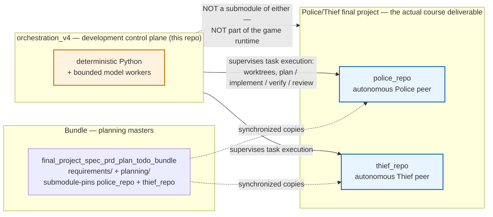
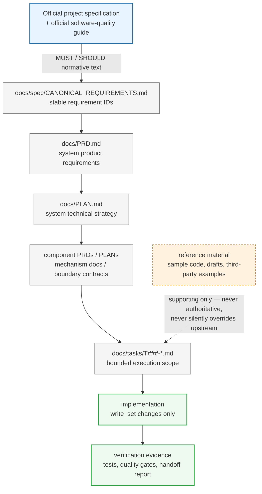
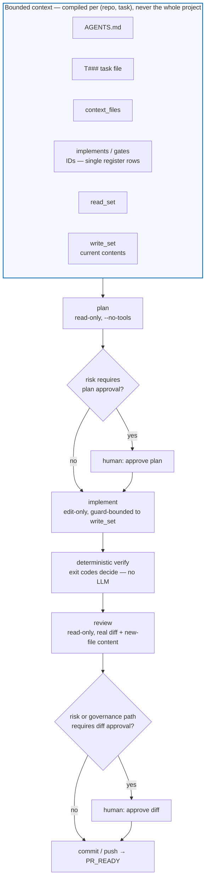
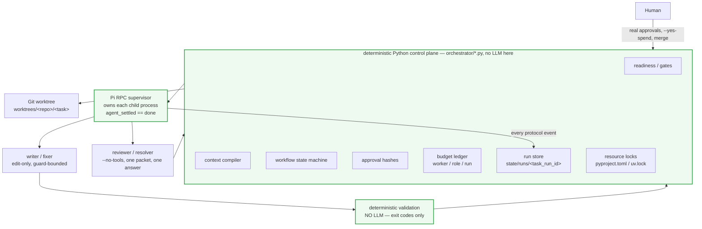
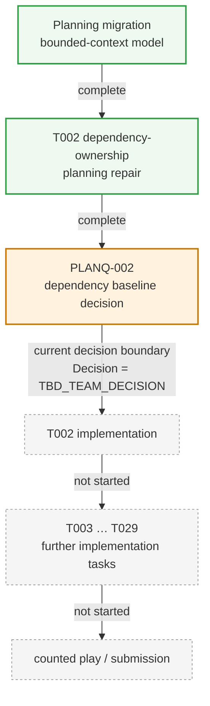

# orchestration_v4 — bounded multi-agent orchestrator

A deterministic development control plane for the Police/Thief final project.
It supervises task execution in `police_repo` and `thief_repo`. It is **not**
part of either project and implements none of their tasks.

This is v4, a surgical redesign of `orchestrate_v3.py`. v3 is preserved
byte-for-byte as the reference prototype and is not edited by this workspace.

---

## What this repository is — and is not



The Police/Thief peers are the product: two autonomous, symmetric processes
implementing a hidden-state P2P game, each with its own repository. The Bundle
holds the shared planning masters (canonical requirements, system PRD/PLAN,
component contracts) that `police_repo` and `thief_repo` keep synchronized
local copies of. `orchestration_v4` is a third thing, sitting outside both: it
is the mechanism a human uses to supervise bounded, auditable implementation
work against those two repositories. It never ships as part of the game, is
never imported by either peer, and is not a submodule of the Bundle.

## Why it exists

Running an LLM agent against a repository at full autonomy is fast to start
and hard to trust: nothing stops it from reading the whole project when a task
needs one file, silently widening its own write scope, or self-certifying that
its own work is correct. This project exists to remove that trust requirement.
An LLM here is a text generator confined to a boundary — never the scheduler,
never the source of project readiness semantics, never its own verifier.
Which task may run, what it may read, what it may write, whether its tests
passed, and whether a human approved it are all decided by deterministic
Python reading the project's own planning artifacts, not by asking a model to
behave.

## Planning and authority hierarchy



Every layer below the official specification is *derived* — it exists to make
the official text actionable, and it must not restate or widen it. A task's
`context_files` and `implements`/`gates` frontmatter point back up this chain
to exactly the rows it needs, never to the whole chain. Reference material
(sample payloads, drafts, third-party snippets) never closes a requirement or
an OPEN item on its own; only a verified official source or an approved team
decision does. `AGENTS.md` in each role repository states this hierarchy
explicitly and instructs every worker — human or model — to stop and escalate
a contradiction rather than pick a side.

## Bounded task lifecycle



A worker starts from roughly a handful of files, per the role repositories'
`AGENTS.md` — not all 115 canonical requirements, all 29 tasks, the whole
Bundle, or every component PRD. Two boundaries are deliberate:

- **IDs come from frontmatter, never from prose.** A task's body saying "the
  GUI toolkit, which `PLANQ-007` owns" is a scope *exclusion*, not a request.
  The compiler records `PLANQ-007` as EXCLUDED with that reason instead of
  loading GUI material.
- **A missing declared file is an error, not a search.** If the compiler
  cannot justify a file, it does not include it; a declared-but-absent path
  refuses with `CONTEXT_FILE_MISSING` rather than triggering a broader read.

The `write_set` is the only mutation scope for the entire lifecycle — enforced
before every write (see [Write-set enforcement](#write-set-enforcement)), not
merely audited afterward. Inspect exactly what a model would receive, with no
model call and no cost:

```sh
uv run orchestrate_v4.py context --repo police --task T002
uv run orchestrate_v4.py context --repo police --task T002 --json
```

Every entry is classified `FULL_FILE`, `TARGETED`, `WRITE_OWNED`, `MISSING` or
`EXCLUDED`, with an access level and the reason it is there.

## Development control-plane architecture



Concretely, a model never: picks the next task, decides a gate is resolved,
widens its own write set, declares its own verification passed, decides that its
own process has finished, decides that another call is affordable, or creates an
approval receipt. Model **roles** are configuration, not code (see
[Model routing](#model-routing) for the full table): a mid-cost model is the
default bounded writer, an independent model of a different family reviews it,
a cheap model absorbs reconnaissance, and stronger reasoning is reserved for
genuine conflicts; the verifier has no model in its loop at all — it runs the
task's declared commands and reads their exit codes.

## Current project phase



`orchestration_v4` exists to supervise the implementation phase, not to record
that it happened; treat the diagram above as the shape of the phase order, and
`orchestrate_v4 status` as the authority on where the repositories actually are
today. As of the planning migration, in both `police_repo` and `thief_repo`: the
bounded-context planning migration is complete; the T002 dependency-ownership
repair is complete; `PLANQ-002` (the dependency baseline decision T002 needs
to close its `dependency_lock` acceptance criterion) is still
`TBD_TEAM_DECISION`. T002 is formally **READY** — claimable and implementable —
because `PLANQ-002` is declared `blocks: criterion`, not `blocks: start`; it is
simply not yet implemented. Every other task depends on T001/T002 and remains
blocked. `orchestrate_v4 status` reflects this live from the repositories'
own registers, not from this document.

## Key safety properties

- **Bounded context, not the whole project.** Compiled per task from
  frontmatter alone; a missing declared file refuses rather than triggers a
  search. See [Bounded task lifecycle](#bounded-task-lifecycle).
- **Mandatory, repository-qualified worktrees.** Every model stage requires a
  recorded, fresh task worktree; there is no fallback to the real Police/Thief
  checkout. See [Worktrees](#worktrees).
- **Pre-write path enforcement, not just a post-run audit.** A blocking Pi
  hook confines the implementer's writes to the worktree and the declared
  `write_set` before they happen. See
  [Write-set enforcement](#write-set-enforcement).
- **Artifact-bound approvals.** A human approval is void if the artifact, base
  commit, stage or repository identity changes by as much as a byte. See
  [Approval hashes](#approval-hashes).
- **Deterministic verification.** Exit codes decide pass/fail; no model
  renders that verdict. See [Write-set enforcement](#write-set-enforcement).
- **Governed spend.** No paid model call happens without an explicit
  `--yes-spend`, a per-call ceiling and a daily budget with a reserve. See
  [Local vs. paid routing, and budget control](#local-vs-paid-routing-and-budget-control).
- **`PR_READY` is not `DONE`.** It means the local implementation/review
  policy is satisfied and a candidate is eligible to ship — never that every
  acceptance criterion or integration gate has passed. See
  [Project gates vs. human review gates](#project-gates-vs-human-review-gates).

Each is covered in full detail in the sections below.

## Project gates vs. human review gates

These are two different things and are represented independently.

**Project gates** come from project planning and live in task frontmatter:
`PLANQ-002`, `G-OFFICIAL`, `blocks: start | criterion | integration`.

The readiness rule is exactly:

```
all depends_on tasks are done
AND no unresolved gate has  blocks: start
```

`blocks: criterion` and `blocks: integration` do **not** make a task unready.
T002 carries `PLANQ-002` at `blocks: criterion`, so it is claimable and
implementable now; only the `dependency_lock` acceptance criterion waits.

The rest of the gate lifecycle is exposed as status, not enforced as a blocker,
because **project readiness**, **local PR readiness**, **criterion closure** and
**integration completion** are four different things:

| level | claim | plan / implement / verify / review | local candidate PR (`pr` → `PR_READY`) | what it actually gates |
|---|---|---|---|---|
| `blocks: start` | refuses (`START_GATE_UNRESOLVED`) | — | — | the task cannot be claimed at all |
| `blocks: criterion` | proceeds | proceeds | **proceeds**, reported as a pending criterion | only a claim that the *named acceptance criterion* is satisfied, and therefore the task being marked done |
| `blocks: integration` | proceeds | proceeds | **proceeds**, reported as a pending integration gate | only a claim that the *named integration gate* has passed |

`PR_READY` means the local implementation/review policy is satisfied and the
candidate is eligible to be committed, pushed and opened as a PR. It does
**not** mean the task is done, that every acceptance criterion is satisfied, or
that any integration gate has passed — an unresolved criterion or integration
gate never blocks reaching it. `pr` prints every pending gate by ID and scope
and records it under `provenance.pending_project_gates`, so PR_READY carries its
own outstanding gates as structured status rather than silently dropping them.
v4 deliberately has no automatic task-close or merge/integration stage yet;
**a future close/merge command MUST enforce these pending gates** before
treating a criterion as satisfied or a task as done.

Gate resolution is derived from the repository's own registers — the
Implementation Decision Register's `Decision` cell, the active OPEN item table,
the input register's `Status` column. Where no mechanical marker exists (the
`G-*` gate *classes* are human judgements about many underlying items), the
harness reports `UNKNOWN_GATE_STATE` and conservatively refuses a start-blocked
task rather than guessing.

**Orchestration review gates** are our development-control policy, keyed by the
task's `risk` field in `config/orchestrator.yaml`:

| risk | required human gates |
|---|---|
| high | plan approval + diff approval |
| medium | diff approval |
| low | none, if all deterministic verification passes |

Regardless of risk, any diff touching a governance path (`AGENTS.md`,
`docs/PRD.md`, `docs/PLAN.md`, `docs/TODO.md`, `docs/spec/`, `docs/decisions/`,
`docs/changes/`, `CONTRIBUTING.md`) always requires human diff approval. A
medium-risk task can be project-ready and still need a human before it ships.

## Worktrees

Police T002 and Thief T002 are different tasks. Worktrees are therefore
repository-qualified:

```
worktrees/police/T002/
worktrees/thief/T002/
```

Each records its repo, repo identity, task ID, base ref, resolved base SHA,
branch and creation time. A worktree built on a base that has since moved is
reported stale (`WORKTREE_STALE_BASE`) instead of being silently reused.

**Every model stage requires one.** `plan`, `implement`, `review`, `verify`, diff
approval and `pr` all operate on the recorded task worktree and refuse with
`WORKTREE_MISSING` if it does not exist, or `WORKTREE_STALE_BASE` if its base has
moved. There is no fallback to the role repository checkout — a forgotten
`worktree` step must refuse, never run a model against the real Police or Thief
tree. Worktree creation stays a separate, explicit, auditable command.

Bounded context is read from that worktree too, so the manifest always describes
the tree actually being edited. The manifest still records the *repository*
identity, so a worktree never becomes a separate repo for approval binding. The
standalone `context` command may read the main checkout only when it can prove
that checkout is clean and its tree equals the base commit's tree; otherwise it
refuses with `TREE_NOT_PROVEN` rather than showing mismatched context.

Runtime metadata — prompts, plans, logs, verification reports — lives in
`state/agent/<repo>/<task>/`, **outside** the worktree, so it cannot be
committed as product code.

## Approval hashes

v3's receipt was `{"approved": true}`, which approves nothing in particular. A
v4 receipt names the artifact:

```json
{
  "task_id": "T002", "repo": "police",
  "repo_identity": "police@https://github.com/evya1/police_repo.git",
  "stage": "diff", "base_sha": "3cba1d9…",
  "artifact_sha256": "…", "approved": true,
  "at": "2026-08-16T…+00:00", "note": "…"
}
```

Validation recomputes all of it. An approval is void if the artifact changes by
one byte, if the base commit moves, if the stage differs, or if it belongs to
the other repository — even when the task ID and bytes match. Receipts live in
`state/approvals/`, outside every repository, so no model worker can create or
alter one.

The diff artifact is a **canonical change manifest** — sorted
`path<TAB>mode<TAB>digest` lines, with `DELETED` sentinels — not `git diff` text.
That survives a git version bump but never survives a real content change,
deletion, rename, executable-bit flip, or file/symlink swap. The mode field is
why a metadata-only mutation cannot ride through an existing approval.

Reviewing is a separate concern from approving. The reviewer receives an actual
**review artifact** — the unified diff against the recorded base, plus the full
contents of newly created untracked text files, plus rename/delete structure —
scoped strictly to the task's change set. Hashes identify a change; they do not
let anyone review code.

## Write-set enforcement

Two layers, and the difference between them matters.

**Pre-write (the actual enforcement).** `--tools` selects tool *names* only, and
`cwd` is **not** a sandbox — neither confines a path. So an implementer runs with
`--no-extensions -e orchestrator/pi_ext/write_guard.ts`, a Pi extension whose
blocking `tool_call` hook refuses every `write`/`edit` whose resolved path is not
BOTH inside the task worktree AND covered by the declared `write_set`. Absolute
outside paths, `../` traversal, symlink escapes, undeclared siblings and `bash`
are all refused, and any tool the guard does not recognise is refused by default.
The policy lives in `orchestrator/write_guard.py`; the TypeScript guard mirrors
it, and a shared case table (`tests/data/write_guard_cases.json`) is replayed
against both so they cannot drift. A stage declaring `write_set_only` refuses to
launch at all if the guard cannot be attached.

**Post-run (defence in depth).** The deterministic Git audit below still runs. It
is not equivalent to pre-write enforcement — by the time it sees a stray file,
the write already happened — so it is a second line, never the first.

The audit covers committed changes vs. base, staged changes, unstaged changes,
untracked files, deletions and renames — a rename is audited on **both** paths,
because moving a file out of the write set mutates a path the task does not own.
All of it uses NUL-delimited git plumbing, never whitespace splitting.

Verification is treated as capable of writing files: state is captured before
the run and compared after, and anything the verification itself produced
outside the write set is reported as `VERIFICATION_SIDE_EFFECT`. Nothing is
auto-deleted — the file is left in place for inspection.

Normal implementation workers edit; they do not run tests. The deterministic
verifier runs the task's declared `## Verification` commands, and **exit codes**
decide whether verification passed. A model may later diagnose a failure; it
never renders the verdict.

## Runtime architecture

```
Human
  |
  v
deterministic Python orchestrator          <- decides everything
  |
  v
Pi RPC (pi --mode rpc, a Python child process)
  |
  v
local GPU or OpenRouter NON-CLAUDE model   <- generates text, decides nothing
  |
  v
deterministic validation (exit codes)
  |
  v
bounded independent NON-CLAUDE reviewer    <- no tools, one packet, one answer
  |
  v
optional NON-CLAUDE resolver, only if necessary
  |
  v
final deterministic validation
  |
  v
HUMAN MERGE GATE                           <- the orchestrator stops here
```

The division of labour is the whole design:

| decided by | what it decides |
|---|---|
| the LLM | what text to propose |
| Python | which task runs, what it may read, what it may write |
| Git | which files actually changed |
| the test suite | whether the change passes |
| the budget ledger | whether another call is allowed |
| the Pi protocol | whether a worker is finished |
| the human | everything irreversible |

Nothing in the runtime asks a model what to do next.

## No-Claude runtime guarantee

**Claude is not a runtime dependency, a worker, a reviewer, a resolver, a
supervisor, a completion detector, or a fallback.**

The active routing table contains no Anthropic model, no role falls back to one,
no unknown-role default reaches one, and the Claude CLI adapter has been removed
rather than merely disabled. This is enforced, not asserted:
`model_router.validate_no_claude_runtime` inspects every place a route can hide —
role primaries, role fallbacks, role-level defaults, top-level defaults, and
enabled adapters — and `doctor` reports the result as a check. Preflight refuses
to start a run against a configuration that fails it.

The rule is "no ACTIVE runtime route", not "the word may not appear".
Documentation and history that mention Claude are deliberately not findings, and
a test asserts that too.

Claude was used once, by a human, to build this. It has no part in running it.

## Model routing

Routing is configuration (`config/models.example.yaml`, overridden by
`config/models.yaml`), not code. Python decides which *role* a stage needs; YAML
decides which model serves that role. A run config **cannot** name a model — that
would let a run promote itself onto a more expensive one — and attempting it is a
configuration error.

Prices below are USD per million tokens, verified live against
`https://openrouter.ai/api/v1/models` on 2026-08-18.

| role | model | family | reasoning | in / out $/Mtok | hard budget |
|---|---|---|---|---|---|
| scout | `qwen3.8-27b` (local) | qwen | medium | 0 / 0 | $0.00 |
| scout_remote | `deepseek/deepseek-v4-flash-0731` | deepseek | medium | 0.14 / 0.28 | $0.04 |
| writer | `google/gemini-3.7-flash` | google | high | 0.375 / 1.875 | $0.40 |
| writer_local | `qwen3-coder-30b` (local) | qwen | medium | 0 / 0 | $0.00 |
| fixer | `qwen3.8-27b` (local) | qwen | medium | 0 / 0 | $0.00 |
| fixer_remote | `google/gemini-3.7-flash` | google | medium | 0.375 / 1.875 | $0.12 |
| reviewer | `deepseek/deepseek-v4-pro-0813` | deepseek | high | 0.66 / 1.98 | $0.25 |
| resolver | `z-ai/glm-5.2` | zai | xhigh | 0.49 / 1.54 | $0.15 |

Writer, reviewer and resolver are three different model families, and tests
assert it: an independent review must not share the writer's blind spots.

**Routing is explicit, never implicit.** Every role ships with `fallbacks: []`
and `allow_weaker_fallback: false`, so an unavailable primary is a refusal, not a
substitution. If a fallback is ever added, a cross-family one additionally
requires `allow_family_substitution: true` — swapping families silently changes
who did the work, what it cost and how it fails.

Two things that are explicitly *not* permissions:

- local availability is not permission to leave the remote tier;
- remote availability is not permission to leave the local tier.

`scout_remote`, `writer_local` and `fixer_remote` exist as separately-named roles
precisely so that moving between tiers is a decision someone made, visible in
config, rather than a fallback that happened.

`reasoning` is a **role** property, not a model property: the same model serves
the writer at `high` and the resolver at `xhigh`. It maps to Pi's normalized
`--thinking` scale (`off|minimal|low|medium|high|xhigh|max`), and the router drops
a level it does not recognise rather than forwarding an invented parameter.

Privileges are enforced in argv and by a blocking tool hook, never in prose:
reviewers, resolvers, scouts and planners run with `--no-tools`; the implementer
and fixer get a tool allowlist without `bash` plus the bounded-write guard; and
everything is audited by Git afterwards.

## Local GPU models

Four models are registered with Pi under the provider `local-llama`, by a Pi
extension that also resolves its own credential. This orchestrator never reads,
stores or prints that credential.

| Pi model id | port | context | role eligibility |
|---|---|---|---|
| `qwen3.8-27b` | 8093 | 65,536 | scout, fixer |
| `qwen3.6-35b` | 8091 | 65,536 | configured, no role assigned |
| `qwen3-coder-30b` | 8090 | 32,768 | writer_local (opt-in) |
| `kat-coder-v2.5-dev` | 8092 | 65,536 | configured, no role assigned |

**Registration is not availability.** The router models three distinct states:

- `CONFIGURED` — this orchestrator's routing table names the model;
- `REGISTERED` — Pi knows it exists, via the provider extension;
- `AVAILABLE_NOW` — a health probe of *that model's own port* just succeeded.

Each model is probed at its own `base_url`, so one running server never makes
the other three look up. A registered model whose server is stopped reports
`REGISTERED / SERVER OFFLINE` and **will not route**; it does not silently
become a paid OpenRouter call.

Server lifecycle is human/external infrastructure responsibility. This
orchestrator never starts or stops a GPU server.

Local workers still record wall time, model calls, tool calls and token usage.
Their inference is recorded as `cost_usd: 0.0`, `cost_source: local_zero`,
which means **zero external API spend** — one line on no OpenRouter invoice. It
is not a claim that the GPU, the electricity or the machine were free.

Zero dollars is also not permission to run forever: local roles carry the same
turn, tool-call, wall-clock, inactivity and retry limits as paid ones, and those
are what actually bound them.

## Pi RPC lifecycle — how a worker is known to be finished

Verified against the installed Pi 0.84.2 `docs/rpc.md` and a live local run.

| event | meaning | terminal? |
|---|---|---|
| `message_end` | one message completed | **no** |
| `turn_end` | one turn completed | **no** |
| `agent_end` | one low-level agent run completed; carries `willRetry`, and retry, compaction or a queued continuation may still follow | **no** |
| `agent_settled` | the run is fully settled; no automatic retry, compaction retry or queued continuation remains | **YES** |

The terminal rule, in full:

```
agent_settled
    -> get_last_assistant_text     (retrieve the final result, exactly once)
    -> get_session_stats           (provider-reported tokens and cost)
    -> parse the structured semantic result
    -> persist
    -> close the process cleanly
```

Four things that are explicitly **not** completion:

```
message_end       != worker complete
agent_end         != worker complete
stdout silence    != worker complete
a text sentinel   != worker complete
```

That last one matters most. A prose marker like `=== REVIEW_DONE ===` has
**zero** effect on the lifecycle — whether it appears in the prompt, appears
early in the model's output, or never appears at all. A sentinel may carry
semantic meaning to a parser. It may not end a process. Regression tests cover
each case.

**Silence is not a state.** The inactivity watchdog does not kill a worker for
producing no prose; every protocol event resets its clock, including tool output
and streaming deltas, so a worker running a long tool call is recognised as
working. When the stream really does go quiet, the watchdog asks Pi
`get_state` and reads `isStreaming` / `isCompacting` before concluding anything.

Lifecycle states: `SPAWNING`, `RUNNING`, `STREAMING`, `AGENT_END_SEEN`,
`SETTLED`, `ABORTING`, `ABORTED`, `FAILED`, `PROCESS_LOST`, `BUDGET_EXCEEDED`,
`TIMED_OUT`, `COMPLETE`.

Framing follows the spec exactly: strict JSONL, split on `\n` only, one optional
trailing `\r` stripped. The reader uses binary `readline()`, which splits on
`b"\n"` and nothing else — a text-mode reader would also split on U+2028/U+2029,
which are legal inside JSON strings.

## Worker result schema

Lifecycle and semantics are two different questions and are never conflated:

- **lifecycle** — did the worker PROCESS finish? Answered by Pi's protocol.
  A settled worker is finished even if it produced nonsense.
- **semantics** — did the worker DO the job? Answered by parsing the structured
  block it was asked to emit.

Every worker prompt ends with a required result block:

```json
{
  "status": "done|blocked|failed",
  "summary": "one or two sentences",
  "files_changed": [],
  "dependency_requests": [],
  "tests_recommended": [],
  "blocking_findings": [],
  "non_blocking_findings": [],
  "needs_human": false
}
```

The reviewer's contract is separate, and it cannot edit anything:

```json
{
  "verdict": "approve|changes_required|blocked",
  "blocking": [],
  "non_blocking": [],
  "informational": [],
  "requirements_checked": [],
  "missing_evidence": []
}
```

This block reports what the worker *believes*. It decides nothing: Git determines
the changed files and the test suite determines whether the work passed.
Reporting `"done"` for code that does not compile makes the report wrong, not the
code correct. A reviewer that merely writes the word APPROVE in prose has
approved nothing — the verdict is read from the structured block or not at all.

Parsing takes the **last** valid object in the reply, so an example quoted
earlier in the prompt can never be mistaken for the answer. A malformed block
earns exactly **one** bounded format-repair request that asks only for the block —
re-running an implementation because a model dropped a brace is how a cheap task
becomes an expensive one.

## Validation levels

Three levels, three moments, three costs. All of them are ordinary shell
commands run by Python inside the task worktree; exit codes decide. The
orchestrator invokes repository validators directly and depends on no Claude
hook.

| level | when | example |
|---|---|---|
| **Level 1 — targeted** | immediately after a bounded edit, and again after a fix | `uv run pytest tests/unit/test_x.py -q`, targeted `ruff`, `git diff --check` |
| **Level 2 — component** | once, before the expensive reviewer is called | component test subset, `ruff check .`, secret checker, dependency check |
| **Level 3 — integration** | once, near merge | `uv sync --locked --all-groups`, `uv run ruff check .`, `uv run pytest`, `scripts/run_quality_gates.py` |

Level 2 exists so an expensive review is never spent on a change that does not
build. Level 3 is not re-run after every one-line edit.

## Review packets

An expensive reviewer that can browse a repository will browse a repository, and
every tool call it makes is another paid generation — so the cost of a review
stops being predictable the moment the model chooses its own inputs.

So the reviewer gets **no tools and no repository**. It gets a packet assembled
by Python from facts the orchestrator can prove:

```
TASK | AUTHORITATIVE REQUIREMENTS | ACCEPTANCE CRITERIA
BASE SHA | CANDIDATE SHA | CANDIDATE DIFF
RELEVANT SOURCE | RELEVANT TESTS
DETERMINISTIC TEST RESULTS | SECURITY CHECKS | DEPENDENCY DIFF
WRITE-SET RESULT | KNOWN LIMITATIONS | QUESTIONS TO REVIEWER
```

It answers **once**. Sections that would exceed the packet's size ceilings are
truncated *visibly*, with an explicit marker and a recorded limitation — a
reviewer must know when it is looking at part of a change. The packet is
persisted as a run artifact, so "what was the reviewer actually shown?" is
answerable later without re-running anything.

A reviewer finding does **not** automatically summon the resolver:

```
straightforward implementation bug   -> cheap fixer, ONCE
architectural / requirement dispute  -> resolver,    ONCE
```

The resolver is read-only, has no tools, answers once, comes from a third model
family, and is never run in a green workflow. There is no "final verifier"
merely because one would sound safer. The normal successful flow is:

```
writer -> deterministic tests -> ONE independent reviewer -> final gates -> human
```

## Budgets

Budgets are first-class state at three scopes at once — worker, role, and whole
task run — plus the daily cap. Each carries an expected cost, a **soft** budget
that warns, and a **hard** budget that forbids.

Before **every** paid generation the question asked is forward-looking: not
"have we overspent?" but "could one more call of this size cross a hard line?"
If yes, **the call is not made**. The same check runs live inside the worker
supervisor at each protocol boundary, so an abort lands before the next
generation is dispatched rather than after it has been billed.

There is no automatic expensive fallback and no hidden escalation. The only way
past a hard budget is a human raising it.

Defaults: run soft `$0.60` / hard `$1.00`; daily `$4.00` with a `$0.75` reserve
and a `$0.50` per-call ceiling.

Cost provenance is labelled on every ledger row and never laundered:

- `provider_reported` — Pi returned per-call usage from the provider. Preferred.
- `catalog_estimate` — priced locally from catalog metadata and a token estimate.
- `local_zero` — local inference: zero external API spend.

**None of these is an OpenRouter invoice**, and `budget` says so on every report.
The ledger (`state/ledger.jsonl`, append-only) records repo, task, run id, stage,
role, provider, model, token counts, cost, duration and exit code. It never
records prompt text or credentials. Spend is recorded whatever the outcome — a
failed call still consumed tokens, and hiding that would corrupt the budget.

## Persistence and recovery

The previous workflow's worst failure was that knowledge of a running worker
lived in a terminal session: close the tab and the work became invisible, and
re-running the command dispatched it a second time.

Run state now lives on disk, is written atomically (write-then-rename, so a
crash mid-write never truncates it), and is **authoritative**:

```
state/runs/<task_run_id>/
    manifest.json         identity, routing, budgets, status, PID, timings
    events.jsonl          every protocol event, appended as it arrived
    worker-result.json    the validated semantic result
    validation.json       deterministic gate results
    review-packet.json    exactly what the reviewer was shown
    reviewer-result.json  the reviewer's structured verdict
    usage.json            tokens, cost and cost provenance
```

No database. A directory per run is inspectable with `cat` and survives anything
short of losing the disk. It is runtime state and is gitignored.

What happens when the terminal closes, the editor restarts, or the orchestrator
is interrupted:

| persisted state | verdict | action |
|---|---|---|
| settled, result persisted | `COMPLETE` | **never redispatch** |
| terminal (aborted / timed out / over budget) | finished | never redispatch |
| dispatched, PID still alive | `STILL_RUNNING` | do not dispatch a second one |
| dispatched, PID gone, no settle | `PROCESS_LOST` | **a human decides** |

Losing a process handle is not evidence that work needs redoing. `PROCESS_LOST`
is deliberately not an automatic re-run: part of the work may already have
happened, and duplicating it is worse than pausing.

```sh
uv run orchestrate_v4.py runs
uv run orchestrate_v4.py runs --task-run-id <id> --json
```

## Failure and retry policy

Retry is a table, not a judgement call made in the moment.

| failure class | action | attempts |
|---|---|---|
| `TRANSIENT_PROVIDER` (5xx, 429, overloaded) | retry the **same exact model** | 1 |
| `MODEL_UNAVAILABLE` | fail closed — no silent family substitution | 0 |
| `LOCAL_SERVER_DOWN` | mark unavailable — no auto-start, no silent move to OpenRouter | 0 |
| `TOOL_ERROR` | report the exact failure — do not re-run the whole task | 0 |
| `MALFORMED_RESULT` | one bounded format repair | 1 |
| `TARGETED_TEST_FAILED` | hand the exact failure output to the cheap fixer | 1 |
| `WRITE_SET_VIOLATION` | block progression; review is not reached | 0 |
| `REVIEW_BLOCKER_SIMPLE` | cheap fixer repairs once | 1 |
| `ARCHITECTURAL_DISAGREEMENT` | resolver, exactly once | 1 |
| `QUIET_WORKER` | inspect protocol state; silence is not failure | 0 |
| `TIMEOUT` | aborted at the hard deadline; state persisted | 0 |
| `BUDGET_EXCEEDED` | abort; human approval required | 0 |
| `PROCESS_LOST` | human decides whether to re-dispatch | 0 |

No entry substitutes a model and no entry exceeds one attempt — tests assert
both. The normal workflow permits **one** implementation correction cycle. Not
two, not "one more to be safe". There are no endless writer/reviewer debates
because the cycle counters make a second round structurally impossible without a
human.

## Installation

```sh
git clone https://github.com/evya1/bounded-multi-agent-orchestrator.git
cd bounded-multi-agent-orchestrator
uv sync --locked --all-groups
```

Requirements:

- **Python** >= 3.12 (developed and tested on 3.14)
- **uv** — dependency management and the runner for every command
- **git** — worktrees, diffs and the write-set audit
- **Pi** >= 0.84.2 on `PATH`, supporting `--mode rpc`
  (`@earendil-works/pi-coding-agent`)
- **OpenRouter credentials** in `OPENROUTER_API_KEY`, for the paid tier only
- **local llama.cpp servers**, optionally, for the zero-external-cost tier

The only runtime Python dependency is PyYAML. Nothing here needs a database, a
queue, a broker, a container runtime or an agent framework.

## Configuration

| file | purpose |
|---|---|
| `config/orchestrator.yaml` | repositories, governance paths, human review policy, resource locks, daily budget |
| `config/models.example.yaml` | model routing, role budgets, privileges, local + OpenRouter tiers. Checked in |
| `config/models.yaml` | optional live override; gitignored, preferred when present |
| `config/runs/<task>.yaml` | one bounded run: which task, and the commands that prove it |
| `state/` | run store, task state, ledger, approvals. Runtime only, gitignored |

Local model registration lives with **Pi**, not here: a Pi extension declares
the `local-llama` provider and its four models, and resolves its own credential
from the environment. The routing table references that extension by path so a
bounded worker — which runs with `--no-extensions` — can still load it.

## Quick start

```sh
# 1. What can this machine actually see and reach? Read-only, spends nothing.
uv run orchestrate_v4.py doctor

# 2. What would this run do? Resolves routing, budgets and context.
#    Calls no model, changes no file, makes no commit.
uv run orchestrate_v4.py run --config config/runs/example-task.yaml --dry-run

# 3. The real bounded run. Stops at the human merge gate.
uv run orchestrate_v4.py run --config config/runs/example-task.yaml --yes-spend

# 4. What survived the terminal closing?
uv run orchestrate_v4.py runs
uv run orchestrate_v4.py budget
```

`doctor` reports every model separately, and never prints a secret:

```
  [ok  ] pi:rpc                    RPC mode started and answered get_state
  [ok  ] provider:openrouter:credentials  OPENROUTER_API_KEY available: YES (value never read or printed)
  [ok  ] model:qwen3.8-27b         AVAILABLE — qwen3.8-27b @ http://127.0.0.1:8093: HTTP 200
  [FAIL] model:qwen3.6-35b         REGISTERED / SERVER OFFLINE — ... registered in Pi but not running
  [FAIL] model:qwen3-coder-30b     REGISTERED / SERVER OFFLINE — ...
  [FAIL] model:kat-coder-v2.5-dev  REGISTERED / SERVER OFFLINE — ...
  [ok  ] model:gemini-3.7-flash    AVAILABLE — google/gemini-3.7-flash: present in the openrouter catalog

  [ok  ] route:scout               qwen3.8-27b (AVAILABLE_NOW)      max_calls=2 wall=180s hard=$0.00
  [ok  ] route:writer              gemini-3.7-flash (AVAILABLE_NOW) max_calls=6 wall=720s hard=$0.40
  [ok  ] route:reviewer            deepseek-v4-pro (AVAILABLE_NOW)  max_calls=2 wall=300s hard=$0.25
  [ok  ] route:resolver            glm-5.2 (AVAILABLE_NOW)          max_calls=1 wall=420s hard=$0.15

  [ok  ] runtime:no-claude         NONE — no active Claude/Anthropic runtime route
  [ok  ] run-store                 /path/to/state/runs
```

A dry run resolves everything a real run would resolve and spends nothing:

```
DRY RUN — police/T002  (complexity=medium)
Nothing below was executed. No paid model was called, no file was changed,
no commit was made.

ROUTING
  implement  role=writer         gemini-3.7-flash       AVAILABLE_NOW
  fix        role=fixer          qwen3.8-27b            AVAILABLE_NOW
  review     role=reviewer       deepseek-v4-pro        AVAILABLE_NOW
  resolve    role=resolver       glm-5.2                AVAILABLE_NOW

BUDGETS / CONTEXT PACKET / WRITE SET / VALIDATION PLAN / HUMAN GATES ...
```

## One-command run

```sh
uv run orchestrate_v4.py run --config config/runs/<task>.yaml --yes-spend
```

drives the whole sequence automatically:

```
PREFLIGHT -> BUILD CONTEXT -> WRITER -> WRITE-SET CHECK -> LEVEL 1
  -> [FIXER] -> LEVEL 2 -> REVIEW PACKET -> REVIEWER
  -> [FIXER or RESOLVER] -> LEVEL 3 -> FINAL REPORT -> HUMAN MERGE GATE
```

Square brackets are conditional and each is entered at most once. Without
`--yes-spend` a run that would route to a paid model refuses and tells you to use
`--dry-run` first.

## CLI

```sh
uv run orchestrate_v4.py doctor
uv run orchestrate_v4.py status
uv run orchestrate_v4.py queue
uv run orchestrate_v4.py models
uv run orchestrate_v4.py runs

uv run orchestrate_v4.py run       --config config/runs/T002.yaml --dry-run
uv run orchestrate_v4.py run       --config config/runs/T002.yaml --yes-spend

uv run orchestrate_v4.py context   --repo police --task T002
uv run orchestrate_v4.py worktree  --repo police --task T002
uv run orchestrate_v4.py plan      --repo police --task T002
uv run orchestrate_v4.py approve   --repo police --task T002 --stage plan --note "..."
uv run orchestrate_v4.py implement --repo police --task T002 --yes-spend
uv run orchestrate_v4.py verify    --repo police --task T002
uv run orchestrate_v4.py review    --repo police --task T002 --yes-spend
uv run orchestrate_v4.py approve   --repo police --task T002 --stage diff
uv run orchestrate_v4.py pr        --repo police --task T002
uv run orchestrate_v4.py budget
```

The single-stage commands remain for step-by-step operation and debugging; `run`
is the normal path. Add `--json` to any command for a machine-readable form.
There is no default repository: `--repo` is always required, because Police T002
and Thief T002 are different tasks.

## Development and testing

```sh
uv sync --locked --all-groups
uv run ruff check .
uv run pytest
```

The default suite makes **zero paid calls**, needs no GPU, no local model
server, no OpenRouter credential and no GitHub write. Model workers are replaced
two ways: a `ScriptedTransport` for exact protocol sequences, and a real
`tests/fake_pi.py` child process that speaks the real JSONL protocol, so process
ownership, framing, watchdogs and shutdown are exercised for real.

One optional live test exists, behind an explicit flag:

```sh
RUN_LIVE_PI_SMOKE=1 uv run pytest tests/test_live_pi_smoke.py
```

It spawns a real `pi --mode rpc` against the local GPU model, waits for
`agent_settled`, retrieves the result and records zero external API spend. If the
GPU server is stopped it **skips** — it never falls back to OpenRouter, because
"the local tier is offline" is a fact about infrastructure, not a reason to spend
money proving a point.

## State machine

```
READY -> PLANNED -> [PLAN_APPROVAL_REQUIRED] -> IMPLEMENTED -> VERIFIED
      -> REVIEWED -> [DIFF_APPROVAL_REQUIRED] -> PR_READY
```

Failures and rejections return to `PLANNED` or `IMPLEMENTED` depending on what
failed. Only declared transitions are legal, so `PR_READY` cannot be reached
without passing through `VERIFIED`.

There is **no autonomous merge**. `pr` means: commit candidate, push the task
branch, open/update the PR, stop. Merging to master remains a separate human
action.

## Provenance

Commit trailers record only what actually happened:

```
Task-Id: T002
Requirement-Ids: NET-001, QR-014
Implemented-By: <model actually used, or none>
Reviewed-By: <model that actually reviewed, or none>
Plan-Artifact-SHA256: <hash, or none>
Diff-Artifact-SHA256: <hash, or none>
Human-Approved: true|false
```

If no independent review ran, the trailer says `Reviewed-By: none`. The harness
does not invent provenance.

## Security and secrets

- No API key value is ever read, printed, logged, committed, or serialized.
  Credential state is reported strictly as `available: YES/NO`.
- The local llama.cpp credential is configured externally and resolved by the Pi
  extension. It is not hard-coded here and appears in no README, example config,
  test fixture, prompt, log, run manifest or commit.
- Documentation uses placeholders only: `<OPENROUTER_API_KEY>`,
  `<LOCAL_LLAMA_API_KEY>`.
- `doctor` never dumps the environment.
- The ledger and the run store record tokens, cost and protocol events — never
  prompts and never credentials.
- Pi's model catalog (`~/.pi/agent/models-store.json`) is read for non-secret
  pricing and availability metadata only.
- The default test suite requires no real secret.
- `state/` is gitignored in full, so run manifests and event streams are never
  committed by accident.

## Limitations

**This is not a hostile-code security sandbox.** Pi runs with the invoking
user's normal permissions, and the bounded-write guard is an in-process Pi
extension — it constrains the agent's *tool calls*, not the process. A model that
could execute arbitrary code outside the tool loop would not be contained by it,
and the guard depends on Pi honouring its own documented `tool_call` blocking
contract. The protections here — mandatory worktree isolation, `--no-tools` for
read-only roles, no `bash` for implementers, pre-write path blocking, and a
deterministic post-run Git audit — are defence against **accidental scope
escape** by a cooperative model. Building a real sandbox (container, seccomp,
separate uid) remains out of scope.

**There is no autonomous merge.** The terminal state is a human merge gate: the
orchestrator commits, pushes and stops. Merging is always a separate human
action, never something this tool does on its own.

Other honest limits:

- **Cost figures are not an invoice.** `provider_reported` is the best available
  figure — Pi's per-call usage from the provider — but reconciling a run against
  OpenRouter's own generation/activity endpoint is not yet automated, and the
  default test suite deliberately does not require it.
- **A hard budget bounds the next call, not the current one.** The supervisor
  checks at every protocol boundary, so an abort lands before the *next*
  generation is dispatched; it cannot claw back a generation already in flight.
  This is a real improvement over a pre-call estimate alone, not a guarantee of a
  penny-exact ceiling.
- **The per-call cost projection is heuristic.** "Could one more call breach the
  hard budget?" is answered from the largest call observed so far, or a fraction
  of the ceiling when nothing has been observed yet. It is deliberately
  pessimistic, which means it can refuse a call that would in fact have fitted.
- **`PROCESS_LOST` needs a human.** Recovery deliberately stops rather than
  re-dispatching, because part of the work may already have happened. Automating
  it safely would need per-stage idempotence the workflow does not yet have.
- **Reasoning-token accounting depends on the provider.** Pi folds reasoning
  tokens into `output` for most providers; the separate field is recorded only
  when a provider actually reports one.
- **Review routing is keyword-driven.** Deciding whether a blocking finding is a
  code bug or an architectural dispute uses a fixed marker list. It is
  deterministic and auditable, but it is a heuristic, and it defaults to the
  cheap fixer — the resolver has to be earned.
- **The bounded-write guard has now been exercised through a live Pi RPC
  process** for lifecycle and process ownership, but its blocking behaviour has
  been proven against its case table in both languages rather than against a
  live model attempting a real escape. The first pilot run should confirm it
  blocks in situ.
- **Local GPU servers are external infrastructure.** The orchestrator detects
  them and refuses to route to a stopped one; it never starts, stops or restarts
  one, and `local_zero` means zero external API spend, not zero real cost.
- Gate *classes* (`G-OFFICIAL`, `G-TEAM`, `G-LIVE`, `G-PROFILE`) have no
  mechanical resolution marker and always report `UNKNOWN_GATE_STATE`. That is
  correct — they are human judgements — but a task with a `blocks: start` gate of
  that kind can only be unblocked by a human.
- `parallel_safe: true` in a task is a task-graph hint, not a runtime proof of
  serialization; overlapping write sets between active tasks refuse regardless.
- Verification commands run as shell strings, verbatim from the task's own
  `## Verification` section or from the run config. Re-tokenising them would
  silently change what the project asked to be run. They are project-authored,
  never model-authored.
- `pr` commits and pushes the task branch; it does not yet open a GitHub PR.
